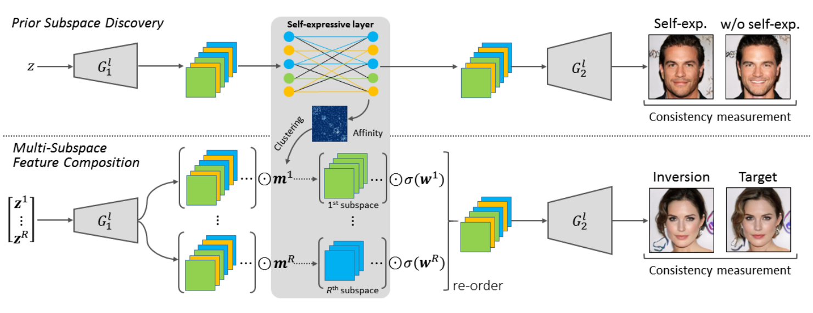
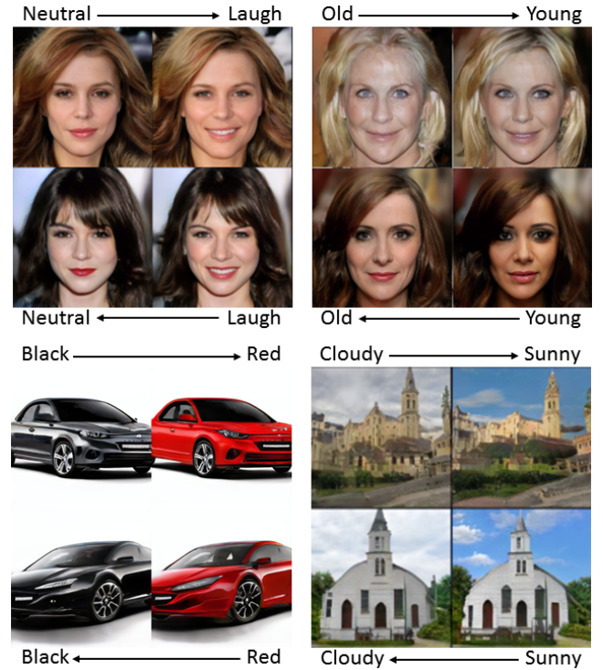

# PmSFC
Implementation for paper *G. Li, Q. Fen, S. Qian, and et al. High Fidelity GAN Inversion via Prior Multi-Subspace Feature Composition*, accepted for Association for Advancements of Artificial Intelligence (AAAI) 2021. For more details, please refer to my [personal website](guanyueli.com/https://guanyueli.com/publication/aaai2021) or read the [PDF](https://ojs.aaai.org/index.php/AAAI/article/view/17017). 

<center>
    
    <br>
    <div style="color:orange;
    display: inline-block;
    color: black;
    padding: 2px;">
    Teaser: The flowchart of the PmSFC. The top one is about excavating useful subspaces from the pre-trained GAN. The bottom one is to cooperate subspace in GAN inversion for high-fidelity inversion. 
    </div>
</center>

## Description
+ /models: This directory contains most of the SOTA generators, e.g., PGGAN, StyleGAN2 and BigGAN. The original repo is from [mGANprior](https://github.com/genforce/mganprior). Please download necessary checkpoints from the following links and place them in the /models/pretrain/tensorflow, the project will convert tensorflow-based checkpoints to pytorch version, and store them in /models/pretrain/pytorch. For a complete link, please refer to [/models/README.MD](https://github.com/guanyuelee/PmSFC/blob/main/models/README.md). 
  
| PGGAN Official | | | |
| :-- | :-- | :-- | :-- |
| Face
| [celebahq-1024x1024](https://mycuhk-my.sharepoint.com/:u:/g/personal/1155082926_link_cuhk_edu_hk/ERkthZuF1rBCrJRURQ5M1W8BbsfT5gFF-TGbuxCAuUJXPQ?e=uKYyQ1)
| Indoor Scene
| [bedroom-256x256](https://mycuhk-my.sharepoint.com/:u:/g/personal/1155082926_link_cuhk_edu_hk/EZeWkI9pbUZDqZAzEUDjlSwB5nDZhe94vmmg4G5QSKGy7A?e=5RhTOo) | [livingroom-256x256](https://mycuhk-my.sharepoint.com/:u:/g/personal/1155082926_link_cuhk_edu_hk/EbHv-4YvGYJJl6i4zH8s25kBqpA1RG-YZbAvp2PSc5CtRA?e=SnSk49) | [diningroom-256x256](https://mycuhk-my.sharepoint.com/:u:/g/personal/1155082926_link_cuhk_edu_hk/Ee2LUJ6fectMiFDYYrZiA1sBD5q4j_FBC8xzH2Z6GSb-JQ?e=pxhVrt) | [kitchen-256x256](https://mycuhk-my.sharepoint.com/:u:/g/personal/1155082926_link_cuhk_edu_hk/ERTDgXhOqJZPlM72bULyKsgBu7nABHvmCBIbwvASzKruvg?e=lIrB34)
| Outdoor Scene
| [churchoutdoor-256x256](https://mycuhk-my.sharepoint.com/:u:/g/personal/1155082926_link_cuhk_edu_hk/EfPAIPVXbYxIn0KQ5IzCJxYBfEG4nP1p7D3MK-N24HLzow?e=za16Z1) | [tower-256x256](https://mycuhk-my.sharepoint.com/:u:/g/personal/1155082926_link_cuhk_edu_hk/EXZGTFQX8gNPgwvCGWKmiIwBxGgU4UTIQy1wezKnpAADMg?e=KUp4hJ) | [bridge-256x256](https://mycuhk-my.sharepoint.com/:u:/g/personal/1155082926_link_cuhk_edu_hk/EXba4rsRrcZDg_6SQk-vClMBmqesihPHY6fne5oobKLHhg?e=9Gk1v3)
| Animal
| [person-256x256](https://mycuhk-my.sharepoint.com/:u:/g/personal/1155082926_link_cuhk_edu_hk/EbILxVQAbd9HsjxXwiOX2PABWHvmIsgrdwmvF0PPQl8_Xw?e=799btl) | [cat-256x256](https://mycuhk-my.sharepoint.com/:u:/g/personal/1155082926_link_cuhk_edu_hk/Ebr89QFQnRJHv-OQ7IMgu-YBG02kswtRukk-9ylUqY8bGQ?e=ioo5m4) | [dog-256x256](https://mycuhk-my.sharepoint.com/:u:/g/personal/1155082926_link_cuhk_edu_hk/EeC5DITcQUNFkBPaVFnS4-YBOpFaVb_5agq_vkPG_aFvlg?e=rnq8Rw) | [bird-256x256](https://mycuhk-my.sharepoint.com/:u:/g/personal/1155082926_link_cuhk_edu_hk/EbvqTPl0ru5MicpQbuIePtgBSwDbzef23TgcrCNcFX5A-A?e=jMRaqB)
| [horse-256x256](https://mycuhk-my.sharepoint.com/:u:/g/personal/1155082926_link_cuhk_edu_hk/EfsJ0u6ZhDhHvleYRd5OCYABCd6Q6uqU1l-AM_C-Cot5_g?e=Fqmudf) | [sheep-256x256](https://mycuhk-my.sharepoint.com/:u:/g/personal/1155082926_link_cuhk_edu_hk/EaIy20hZi5pHkVZhO7p38OoBrjInx6UAFzwAMtG_fcnUCg?e=A6ax03) | [cow-256x256](https://mycuhk-my.sharepoint.com/:u:/g/personal/1155082926_link_cuhk_edu_hk/ETcm1hzw7M5Mmbi1vHNAA1sBNZcCwXr1Y_y-nwVqEcNHKQ?e=IE0Cu0)

+ /bin: contains some testing generated images and pretrained affinity matrixs.

+ /examples: contains some target images. 
  
+ Note: The original repo has some mistakes in loading StyleGAN, and I have corrected them. I also add many personal utilities to the repo, e.g., getting intermediate features for calculating subspaces. It could be messy, so you can pull requests if you are interested. 

## Environment
Please use following command to install the environment. 
```
python -m pip install -r requirements.txt
```
I also provide the conda environment in file *conda_env.yaml* if you are interested. 
```
conda env create -f conda_env.yaml
```

## Run the code
Take CelebaHQ as example, you can find useful subspaces by running the command. 
```
python discover_subspace.py \
--outputs=./TRAIN --inversion_type=PGGAN-Layerwise \
--gan_model=pggan_celebahq --layer=3 --iterations=200 \
--optimization=Adam --lr=0.0001 --report_image=5 \
--report_model=5 --batch_size=4 --exp_id=SelfExpress \
--init_type=Zeros --beta=1 --cluster_numbers=6 --alpha=0.2 \
--subspace_dimension=6 --sparse_type=L1 --power=2.0
``` 

Place the pretrained affinity matrix to args.matrix_dir and run the following command. 
```
python PmSFC.py --outputs=./TRAIN \
--inversion_type=PGGAN-Layerwise --gan_model=pggan_celebahq \
--layer=3 --iterations=20000 --optimization=Adam --lr=0.0001 \
--report_image=5 --report_model=5 --batch_size=4 --exp_id=SelfExpress \
--beta0=1 --beta1=1 --n_subs=6 --alpha=0.2 --d_subs=6 \
--sparse_type=L1 --power=2.0 \
--matrix_dir=./bin/pggan/celebahq/matrix/layer3/value50.pkl
```

You should get similar results like this: 

<center>
    
    <br>
    <div style="color:orange;
    display: inline-block;
    color: black;
    padding: 2px;">
    Subspace visualization by switching the subspace features. 
    </div>
</center>


